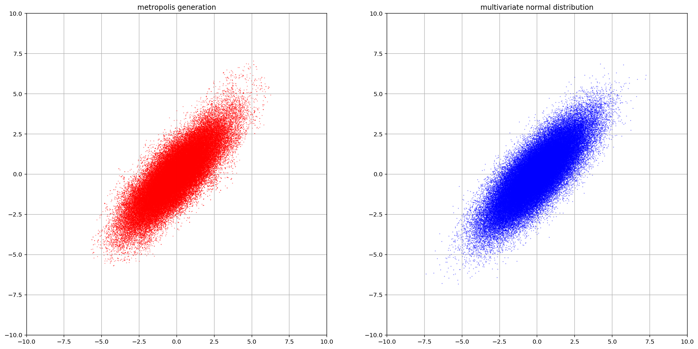
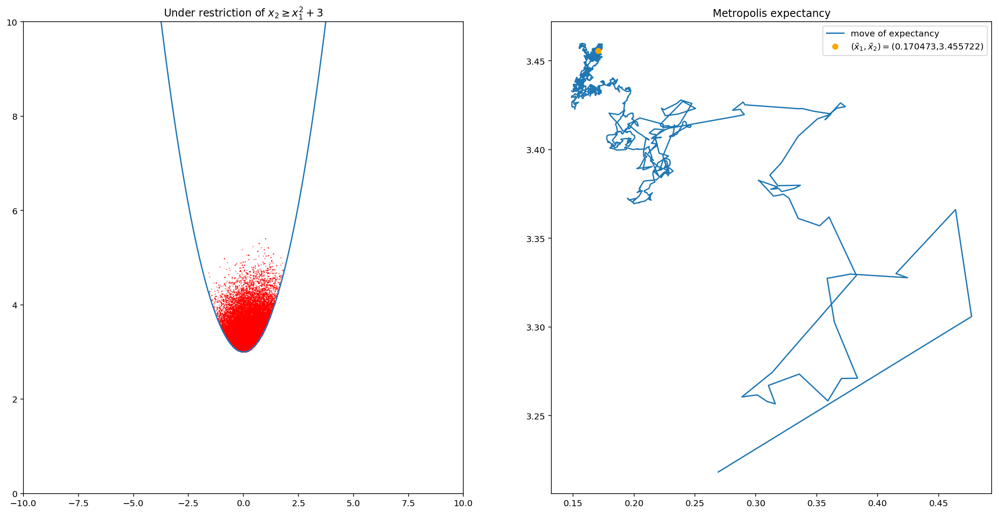

## 連続変数のメトロポリス法

次の２変量正規分布を考える。

$$
p(x_1,x_2)=\frac{1}{Z}\exp\left(-\frac{x_1^2-2bx_1x_2+x_2^2}{2}\right)
$$

### アルゴリズム

* 任意に初期状態 $(x_1,x_2)$ を一つ選ぶ
* 適当な原点対称の分布$\alpha(x_1,x_2)$ より $\Delta_1,\Delta_2$ を発生させる。
* 候補点 $(x_1^\prime,x_2^\prime)$ を次式で定める。
$$
\begin{align*}
 x_1^\prime \leftarrow x_1+\Delta_1\\
 x_2^\prime \leftarrow x_2+\Delta_2
\end{align*}
$$

* $r\leftarrow \frac{p(x_1^\prime,x_2^\prime)}{p(x_1,x_2)}$ を計算する。
* 一様乱数 $R\in[0,1]$ を発生させて、 $R<r$ なら候補点を採用し、他のときは元の点にとどまる。


```python
import numpy as np
from numpy.random import *
from matplotlib import pyplot as plt
%matplotlib inline

class gauss_dim_2():
    def __init__(self,b,step):
        self.b=b
        self.step=step
        self.x=np.array([0,0])

    def gaussian_index(self,x_1,x_2,b):
        return -(x_1**2-2*b*x_1*x_2+x_2**2)/2
    
    def relative_rate(self,x_1_prime,x_2_prime):
        return np.exp(self.gaussian_index(x_1_prime,x_2_prime,self.b)-self.gaussian_index(self.x[0],self.x[1],self.b))
    
    def gen_val(self):
        record=[]
        for i in range(self.step+1000):
            del_x=rand(2)-0.5
            x_prime=self.x+del_x
            r=self.relative_rate(x_prime[0],x_prime[1])
            switch_prob=rand()
            if switch_prob < r:
                self.x=x_prime
            record.append(self.x)
        return record


```


```python
b=0.8
gauss=gauss_dim_2(b=b,step=100000)
record=gauss.gen_val()
correct=multivariate_normal([0,0],[[1/(1-b**2),b/(1-b**2)],[b/(1-b**2),1/(1-b**2)]],100000)
def gen_x_y_pair(lists):
    return [list_[0] for list_ in lists],[list_[1] for list_ in lists]
record_x,record_y=gen_x_y_pair(record)
correct_x,correct_y=gen_x_y_pair(correct)

plt.clf()
plt.figure(figsize=(20,10))
plt.subplot(1,2,1)
plt.plot(record_x,record_y,".",color="red",markersize=0.5)
plt.title("metropolis generation")
plt.xlim((-10,10))
plt.ylim((-10,10))
plt.grid()
plt.subplot(1,2,2)
plt.title("multivariate normal distribution")
plt.plot(correct_x,correct_y,".",color="blue",markersize=0.5)
plt.xlim((-10,10))
plt.ylim((-10,10))
plt.grid()
plt.show()
```


    <matplotlib.figure.Figure at 0x1373bb588>





変数に制約条件が課されているときを考える。
$x_1,x_2$ の間に例えば $x_2\geq x_1^2+3$ という制約条件が課せられており、この制約条件を満たす範囲内で $\exp\left(-\frac{x_1^2-2bx_1x_2+x_2^2}{2}\right)$ の出現の「重み」で、範囲外では出現の「重み」がゼロであるとする。適当な正規化を施せば( $\exp\left(-\frac{x_1^2-2bx_1x_2+x_2^2}{2}\right)$ の領域内の積分値で割ってやれば)確率分布になるが、
これにメトロポリス法を適用してみる。右の分布だけ見ると正しく生成されているかわからないが、平均値の動きを見ると定常値に収束していることがわかる。


```python

class gauss_dim_2_restrict():
    def __init__(self,b,step,restrict_func):
        self.b=b
        self.step=step
        self.x=[0,4]
        self.f=restrict_func

    def gaussian_index(self,x_1,x_2,b):
        return -(x_1**2-2*b*x_1*x_2+x_2**2)/2
    
    def relative_rate(self,x_1_prime,x_2_prime):
        return np.exp(self.gaussian_index(x_1_prime,x_2_prime,self.b)-self.gaussian_index(self.x[0],self.x[1],self.b))
    
    def gen_val(self):
        record=[]
        for i in range(self.step+1000):
            del_x=normal(0,0.8,2)
            x_prime=self.x+del_x
            if self.f(x_prime) == True:
                r=self.relative_rate(x_prime[0],x_prime[1])
                switch_prob=rand()
                if switch_prob < r:
                    self.x=x_prime
                record.append(self.x)
        return record[1000:]

def rest_func(x):
    f=x[1]-0.5*x[0]*x[0]-3
    if f > 0:
        return True
    else:
        return False

gauss_rest=gauss_dim_2_restrict(b=0.2,step=10**5,restrict_func=rest_func)
record_res=gauss_rest.gen_val()
record_res_x,record_res_y=gen_x_y_pair(record_res)
ave_x=[]
ave_y=[]
ave_x_val=0
ave_y_val=0

for i in range(len(record_res_x)):
    ave_x_val+=record_res_x[i]
    ave_y_val+=record_res_y[i]
    ave_x.append(ave_x_val/(i+1))
    ave_y.append(ave_y_val/(i+1))

x=np.arange(-10,10,0.1)
y=(x**2)/2+3
plt.figure(figsize=(20,10))
plt.subplot(1,2,1)
plt.title("Under restriction of $x_2\geq x_1^2+3$")
plt.xlim((-10,10))
plt.ylim((0,10))
plt.plot(record_res_x,record_res_y,".",color="red",markersize=0.5)
plt.plot(x,y)
plt.subplot(1,2,2)
plt.title("Metropolis expectancy")
plt.plot(ave_x,ave_y)
plt.plot(ave_x[-1],ave_y[-1],"o",color="orange")
plt.legend(("move of expectancy",r"$(\bar{x}_1,\bar{x}_2)=$(%f,%f)" % (ave_x[-1],ave_y[-1])))
plt.show()

```





```python

```


```python

```
